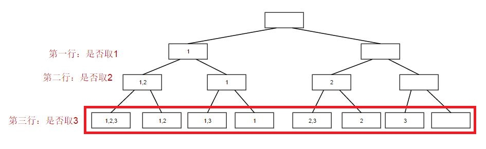
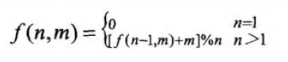

###   1. 排序

##### 56. 合并区间

题目要求：合并给定的区间集合中重合的区间

我的思路：设置两个指针，内外循环，两两比较区间，若重合，则同时更新两个区间左右区间值。循环完毕，重复的区间值仅取一个即可。

我的解答：（测试用例通过，提交未通过）

```java
// 将p指向的区间与其后每一个区间逐一比较，若重复，则同时更新p、q所指区间值
for(int p=0; p<intervals.length-1; p++) { // p指针，外循环
    for(int q=p+1; q<intervals.length; q++) { // q指针，内循环
        if(intervals[p][0]<=intervals[q][0] && intervals[q][0]<=intervals[p][1]) {
            if(intervals[p][1]<=intervals[q][1]) {
                intervals[p][1]=intervals[q][1];
                intervals[q][0]=intervals[p][0];
            }else {
                intervals[q][0]=intervals[p][0];
                intervals[q][1]=intervals[p][1];
            }
        }else if(intervals[p][0] > intervals[q][0] && intervals[p][0]<=intervals[q][1]){
            if(intervals[p][1]<=intervals[q][1]) {
                intervals[p][0]=intervals[q][0];
                intervals[p][1]=intervals[q][1];
            }else {
                intervals[p][0]=intervals[q][0];
                intervals[q][1]=intervals[p][1];
            }
        }
    }
}
```

**参考解答：**

```java
/*
 *思路：
 * 1、先对所有区间按照左端点值升序排序；
 * 2、一次遍历，将第一个区间插入merged数组中，然后按顺序考虑之后的每个区间；
 * 3、若当前区间的左端点大于前一个区间的右端点，则区间不重合，直接插入当前区间；
 * 4、若当前区间的左端点小于前一个区间的右端点，则区间重合，取较大的右端点更新重合区间的右端点。
 */
public int[][] merge(int[][] intervals){

    List<int[]> res = new ArrayList<>();

    /*
	 *	根据重写的比较器Comparator，实现对区间集合按照左端点值升序排序
	 *	sort()方法底层采用归并排序，时间复杂度为：O(n log n)
	 */
    Arrays.sort(intervals, new Comparator<int[]>(){
        @Override
        public int compare(int[] a, int[] b) {
            return a[0]-b[0]; // 比较两个区间的左端点值
        }
    });

    /*
	 *	对区间集合进行遍历，仅需一次
	 */
    int i = 0;
    while(i < intervals.length) {
        int left = intervals[i][0];
        int right = intervals[i][1];
        // 遍历，比较下一个区间的左端点值和当前区间i的右端点值
        while(i < intervals.length-1 && right > intervals[i+1][0]) {
            // i+1区间的左端点值小于i区间的右端点值，区间重合
            right = Math.max(right, intervals[++i][1]); // 取i和i+1区间右端点的较大者
        }
        res.add(new int[] {left, right}); // 向结果集中插入独立的区间
        i++;
    }
    return res.toArray(new int[0][]);
}
```

总结：

- 时间复杂度：算法的性能主要消耗在排序时，由于采用归并排序，则 O( n log n)
- 空间复杂度：O（n）


##### 75. 颜色分类（ 荷兰国旗问题 ）

题目要求：

- 给定一个包含红色、白色和蓝色，一共n个元素的数组，原地对它们进行排序，使得相同颜色的元素相邻，并按照红色、白色、蓝色顺序排列。
- 使用整数 0、 1 和 2 分别表示红色、白色和蓝色

两种思路：

- 1. 使用计数排序，遍历一次数组，分别得出0，1和2的数量，再分别覆写原数组；

- 2. 设置边界指针

  > （1）设置指针p0、p2、curr，分别指向0的右边界、2的左边界和当前元素，
  > （2）当前元素为0时，curr与p0指向的元素互换，curr和p0分别右移一位；
  > （3）当前元素为1时，curr右移一位；
  > （4）当前元素为2时，curr与p2指向的元素互换，p2左移一位，需注意，curr必须再检查一次，因为刚互换的至curr的可能是0。

思路2的代码如下：

```java
package LeetCode.Sort;
/**
 * @date 2019-12-02
 * @author Merlin
 */
public class SortColors {
	public void sortColors(int[] nums) {
		int curr = 0;
		int p0 = 0;
		int p2 = nums.length-1;
		while(curr <= p2) { // curr超过2的右边界时即完成排序
			if (nums[curr]==0) {
				swap(nums,curr++, p0++);
			}else if(nums[curr]==2) {
				swap(nums, curr, p2--);
			}else {
				curr++;
			}
		}
	}
	
	private void swap(int[] nums, int i, int j) {
		int tmp = nums[i];
		nums[i] = nums[j];
		nums[j] = tmp;
	}
}
```


##### 969. 煎饼排序

题目要求：给定数组A，选择一些正整数 k <= A.length，反转A的前k个元素的顺序。执行零次或多次煎饼翻转以完成对数组A的排序。翻转次数在 10 * A.length 范围内。

思路：将两次翻转视为一个循环，每一次循环之后，位于循环区间内的元素，最大的值落到最右边，类似于冒泡排序。

> 此题仍需进一步改进

我的解答：（ 通过 ）

```java
package LeetCode.Sort;

import java.util.ArrayList;
import java.util.List;
/**
 * @date 2019-12-01
 * @author Merlin
 */
public class PancakeSort {

	private List<Integer> target;

	public List<Integer> pancakeSort(int[] A) {
		int flag = A.length-1;
		target = new ArrayList<Integer>();
		while(flag>=1) {
			sort(A, flag);
			flag--;
		}
		return target;
	}
 
	private void sort(int[] A, int range) {
		int maxEleIndex = getMaxElementIndex(A, range);
		traverse(A, maxEleIndex); // 通过反转[1, maxEleIndex]部分，使得maxEleIndex对应的元素被调至索引1处
		target.add(maxEleIndex+1);
		traverse(A, range); // 再反转，使得最大值调至最后一位
		target.add(range+1);
	}
 
	// 反转数组A中[1,index]中的元素
	private void traverse(int[] A, int index) {
		int mid = index/2;
		for(int i=0;i<=mid;i++) {
			exch(A, i, index-i);
		}
	}
	
	// 在索引[1, count]范围寻找最大的元素，并返回相应的索引
	private int getMaxElementIndex(int[] A, int range) {
		int index = 0;
		for(int i=1;i<=range;i++) {
			if(A[index]<A[i]) {
				index = i;
			}
		}
		return index;
	}
 
	private void exch(int[] A, int i, int j) {
		int tmp = A[i];
		A[i] = A[j];
		A[j] = tmp;
	}
	
}
```

总结：通过类似冒泡排序的方法，每一次循环都将参与的元素中最大值翻转至数组最右端，其时间复杂度为：     O ( n^2 )。

目前存在以下两个疑问：

- 若数组初始即有序，如何避免进行翻转操作？

- 若数组初始逆序，如何确保一次翻转即可完成？


参考算法：

```java
public class PancakeSort {
    public List<Integer> pancakeSort(int[] A) {
        List<Integer> ans = new ArrayList();
        int N = A.length;

        Integer[] B = new Integer[N];
        for (int i = 0; i < N; ++i)
            B[i] = i+1;
        Arrays.sort(B, (i, j) -> A[j-1] - A[i-1]);

        for (int i: B) {
            for (int f: ans)
                if (i <= f)
                    i = f+1 - i;
            ans.add(i);
            ans.add(N--);
        }

        return ans;
    }
}
```


##### 973. 最接近原点的 K 个点

题目要求：从由平面上的点组成的列表 `points`中找出 `K` 个距离原点 `(0, 0)` 最近的点。

思路：计算所有点距原点距离的平方并排序，找到 K 个较小的值，其中 distK 为临界值。对所有点逐一进行判断，若该点距原点距离的平方不大于 distK ，说明该点符合要求。依次找出所有点。

我的解答：（ 通过 ）

```java
package LeetCode.Sort;

import java.util.Arrays;
import Algorithms.sort.heap.HeapSort.HeapSort;
/**
 * @date 2019-11-27
 * @author Merlin
 */
@SuppressWarnings("all")
public class kClosest {
	public int[][] kClosest(int[][] points, int K) {
		int[] distArray = calculateTotalSquares(points);
		int distK = sortAndReturn(distArray, K); // 找到距原点最近的K个点中的临界点
		return findKClosest(points, distK, K);
	}
	
	/*
	 * 	根据距原点最近的K个点中的临界点，逐一比较二维数组所代表的点，符合时
	 * 	存入辅助二维数组kPoints，最后返回该二维数组，即为题意所求
	 */
	private int[][] findKClosest(int[][] points, int distK, int K){
		int[][] kPoints = new int[K][2]; // 存放K个距离原点 (0, 0) 最近的点
		int cnt = 0;
		for(int i=0;i<points.length;i++) {
			if(calculateSquares(points[i])<=distK) {
				kPoints[cnt++] = points[i];
			}
		}
		return kPoints;
	}
	
	// 计算二维数组中所有点距原点距离的平方和，并存入辅助数组
	private int[] calculateTotalSquares(int[][] points) {
		int N = points.length;
		int[] distArray = new int[N];
		for(int i=0;i<N;i++) {
			distArray[i] = calculateSquares(points[i]);
		}
		return distArray;
	}
	
	// 计算二维数组中代表的点距原点距离的平方和
	private int calculateSquares(int[] point) {
		return (int) (Math.pow(point[0], 2)+Math.pow(point[1], 2));
	}
	
	// 对数组distArray进行排序，并返回第k-1位元素
	private int sortAndReturn(int[] distArray, int K) {
		Arrays.sort(distArray);
		return distArray[K-1];
	}
		
}
```

总结：

- 时间复杂度 O ( n log n )
- 空间复杂度 O ( n )

---

### 2. 递归

##### 509. 斐波那契数列

题目：斐波那契数列，同解的算法有：兔子繁殖、青蛙爬楼梯。

> 解法多达六种，在此仅介绍有代表性的三种

1、递归解法

```java
public int fib(int N) {
    if(N<=1){
        return N;
    }
    return fib(N-1) + fib(N-2);
}
```

算法分析

- 时间复杂度：O(2^N)，在所有的算法中，性能最差！
- 空间复杂度：O(N)，可能会存在栈溢出风险！

2、带记忆的自底向上的方法

```java
public int fib(int N) {
    // 自底向上+记忆：利用数组，缓存已计算的值
    if(N<=1){
        return N;
    }
    return computeAndCache(N);
}

private int computeAndCache(int N){
    int[] aux = new int[N+1]; // 0~N，N+1个数
    aux[1] = 1; // aux[0]初始化即为0
    for(int i=2;i<=N;i++){
        aux[i] = aux[i-2]+aux[i-1];
    }
    return aux[N];
}
```

算法分析

- 时间复杂度：O(N)
- 空间复杂度：O(N)

3、Binet公式

```java
public int fib(int N) {
    double goldenRatio = (1 + Math.sqrt(5)) / 2;
    return (int)Math.round(Math.pow(goldenRatio, N)/ Math.sqrt(5));
}
```

算法分析

- 时间复杂度：O(1)
- 空间复杂度：O(1)

---

### 3. 数组

##### 189. 旋转数组【环状替换】

题目：给定一个数组，将数组中的元素向右移动 k 个位置，其中 k 是非负数。

思路：

- 1、暴力法：每次移动一位，重复k次。时间复杂度：O(k*n)，空间复杂度：O(1)；
- 2、辅助数组：时间复杂度：O(n)，空间复杂度：O(n)；
- **3、环状替换**：从第1位开始，将第1位元素移动k位，并以被替换的元素为新起点继续移动，直至全部移动完成。时间复杂度：O(n)，空间复杂度：O(1)。

*环状替换* 的难度在于：**移动过程中，再次回到原起点，此时需要人为地将起点改变，否则旋转结果会异常。**

```java
/**
 * LeetCode 189.旋转数组
 * Q：给定一个数组，将数组中的元素向右移动 k 个位置，其中 k 是非负数。
 * @date 2020-02-20
 * @author Merlin
 */
public class SolutionA {
	/*
	 *	第一次提交的暴力解法，时间复杂度为O(k*n)，超时；
	 *	第二次提交的算法，时间复杂度优化为O(n)，但针对特殊的k、n值出现输出异常
	 *	结合官方题解，现总结如下：若 n % k == 0，则一定会导致在尚未遍历完数组的
	 *	情况下再次回到出发点，这也是第二次提交的算法针对特定的k、n值会报错的原因。
	 *	结合官方题解给出的"环状替换法"修正算法  
	 */
	public void rotate(int[] nums, int k) {
		k = k % nums.length; // k，k+(nums.length)，k+(2*nums.length) 等，移动效果等同于k
		int count = 0; // 统计元素移动次数
		
		// start：起始位，当未遍历完再次回到出发点时，执行start++，人为地改变起始位
		for(int start=0; count<nums.length; start++) {
			int p = start; // 当前待移动元素的索引
			int pVal = nums[p]; // 当前待移动的元素值
			// 从起始位开始正常执行替换；若在执行过程中再次回到出发点start位，将其加1
			do {
				p = (p + k) % (nums.length);
				int temp = nums[p];
				nums[p] = pVal;
				pVal = temp;
				count++;
			}while(p!=start);
		}
	}
}
```


##### 977. 有序数组的平方【双指针】

题目：给定非递减的整数数组A，按非递减顺序排序返回每个数字的平方组成的新数组，元素可重复。

思路（2种）：

- 1、先求平方，后排序。时间复杂度为：**O( n log n)**，空间复杂度为：**O(n)**。
- 2、使用 **双指针** 分别标记 负数 和 非负数，分别求平方、比较、插入，时间和空间复杂度均为：**O(n)**。

算法2：*重点是运用双指针，提高算法效率*

```java
public int[] sortedSquares(int[] A) {
    int len = A.length;
    int pos = 0; // 非负数指针
    while(pos<len && A[pos]<0) {
        pos++;
    }
    int neg = pos-1; // 负数指针
    int[] res = new int[len];
    int cnt = 0;

    while(neg>=0 && pos<len) {
        if(A[pos]*A[pos] <= A[neg]*A[neg]) {
            res[cnt++] = A[pos]*A[pos];
            pos++;
        }else {
            res[cnt++] = A[neg]*A[neg];
            neg--;
        }
    }
    while(pos<len) {
        res[cnt++] = A[pos]*A[pos];
        pos++;
    }
    while(neg>=0) {
        res[cnt++] = A[neg]*A[neg];
        neg--;
    }

    return res;
}
```


##### 989. 数组形式的整数加法【逐位求和】

题目要求：给定非负整数X的数组形式A，加[0, 10000]的整数K，返回数组形式。

思路：切不可强行求出A（其值或溢出），须逐位计算，考虑进位及最终结果的首位是否非0。

我的解答：（已通过）

```java
public List<Integer> addToArrayForm(int[] A, int K) {

    ArrayList<Integer> resList = new ArrayList<>();
    int A_len = A.length;

    // 若数组A的长度小于5，则新建长度为5的新数组，并填入A中数据，高位填充0
    if(A_len < 5) {
        int[] aux = new int[5];
        for(int i=0;i<A_len;i++) {
            aux[(5-A_len)+i] = A[i];
        }
        A = aux;
    }

    int[] aux = new int[A.length+1]; // 辅助数组恰好比A数组长1位
    int i = 1;
    for(int j=A.length-1;j>=0;j--) {
        int k = 0; // K最大为10000，若i超过5，则第i位必然为0
        if(i<=5) {
            k = (int) ((K % Math.pow(10, i)) / Math.pow(10, i-1)); // 求K第i位上的数字
        }
        int t = aux[j+1]; // 取辅助数组j+1位（与A数组j位相对应）的数，若上一步计算有进一位，则为1，否则为0
        if((A[j]+k+t) >= 10) {
            // 与A数组索引j对应的辅助数组索引j+1，若待插入数字大于9，则减10后插入，并向前进一位
            aux[j+1] = A[j]+k+t-10;
            aux[j] = 1;
        }else {
            aux[j+1] = A[j]+k+t; // 不需进位，直接插入
        }
        i++;
    }

    // 从辅助数组0索引开始，寻找首位非0值
    // 特殊情况是数组A只含一个0，且K为0
    int start = 0;
    while(start<aux.length-1) {
        if(aux[start]!=0) {
            break;
        }
        start++;
    }

    // 从辅助数组首个非0位开始，存入并返回List
    for(i=start;i<aux.length;i++) {
        resList.add(aux[i]);
    }
    return resList;
}
```


##### 1010. 总持续时间可被60整除的歌曲【巧用取余运算】

题目：对于数组 int[] time，返回两两元素和可以被60整除的元素对数目。

思路：**若两数相加可被60整除，则两数分别对60取余后的和一定等于0或60**。

我的解答：（已通过）

```java
public int numPairsDivisibleBy60(int[] time) {
    // 若两数相加可被60整除，则两数分别对60取余后的和一定等于0或60
    int[] aux = new int[60];
    for(int i=0;i<time.length;i++){
        aux[(time[i] % 60)]++;
    }

    int total = ((aux[0])*(aux[0]-1)+(aux[30])*(aux[30]-1))/2; // 余为0和30时
    for(int i=1;i<30;i++){
        total += aux[i] * aux[60-i];
    }
    return total;
}
```


##### 1128. 等价多米诺骨牌对问题

题目：形式上，dominoes[i] = [a, b] 和 dominoes[j] = [c, d] 等价的前提是 a==c 且 b==d，或是 a==d 且 b==c。在 0 <= i < j < dominoes.length 的前提下，找出满足 dominoes[i] 和 dominoes[j] 等价的骨牌对 (i, j) 的数量。

解题技巧：因为规定了 “元素值在[1, 9]”，对符合等价条件的数组进行排序，将左端点值视为十位数，右端点值视为个位数，将二者和视为数组 int[100] 的索引，其中数组中保存相同的二维数组出现的次数。

```java
public int numEquivDominoPairs(int[][] dominoes) {
    int count = 0;
    int[] aux = new int[100];
    for(int[] arr : dominoes) {
        Arrays.sort(arr);
        count += aux[10*arr[0]+arr[1]]++;

    }
    return count;    
}
```

总结：

- 上述算法仅需要遍历一遍数组，调用的排序方法仅需对两个整数排序，可忽略其性能影响，所以时间复杂度为：O ( n )。
- 空间复杂度：O ( 1 )。


##### 面试题04. 二维数组中的查找

《剑指Offer》题目：在一个 n * m 的二维数组中，每一行都按照从左到右递增的顺序排序，每一列都按照从上到下递增的顺序排序。请完成一个函数，输入这样的一个二维数组和一个整数，判断数组中是否含有该整数。

思路：

- 暴力法，时间复杂度为O(N*M)；
- 标志数法，时间复杂度为O(N+M)。

```java
// 暴力法
boolean findNumberIn2DArray(int[][] matrix, int target) {
    if(matrix==null || matrix.length==0 || matrix[0].length==0 ||
       target < matrix[0][0] || target > matrix[matrix.length-1][matrix[0].length-1]){
        return false;
    }

    for(int i=0; i<matrix.length; i++){
        for(int j=0; j<matrix[i].length; j++){
            if(matrix[i][j]==target){
                return true;
            }
        }
    }
    return false;
}
```

**标志数法**：暴力法的时间复杂度为O(N*M)。若二维矩阵行、列均是无序、无规律可循，只能采用暴力法。题目假定了二维数组每一行、每一列均是递增。因此，巧妙地利用此规律，才能实现降低算法复杂度。

以左下角的元素为标志数，其有如下特点：

1. 标志数等于目标值时，直接返回true；

2. 标志数大于目标值时，目标值一定在标志数所在行的上面某一行之中；

3. 标志数小于目标值时，目标值一定在标志数所在列的右边某一列之中。

因此，结合标志数，每一次比较则可消去一行或者一列，使算法复杂度为O(M+N)。

```java
// 标志数法
boolean findNumberIn2DArray(int[][] matrix, int target) {
    if(matrix==null || matrix.length==0 || matrix[0].length==0 ||
       target < matrix[0][0] || target > matrix[matrix.length-1][matrix[0].length-1]){
        return false;
    }
    
    int row = matrix.length-1;
    int column = 0;
    int flag;
    for(; row >= 0 && column < matrix[0].length; ){
        flag = matrix[row][column];
        if(flag == target) return true;
        else if(flag > target) row--;
        else column++;
    }
    return false;
}
```


### 4. 链表

##### 21. 合并两个有序链表

题目：合并两个有序链表，并返回合并后的新链表。

两种解法

> 1. 迭代
> 2. 递归

解法一：（我的解法，迭代）

```java
public ListNode mergeTwoLists(ListNode l1, ListNode l2) {
    if(l1==null && l2==null){
        return null;
    }
    if(l1!=null && l2==null){
        return l1;
    }
    if(l2!=null && l1==null){
        return l2;
    }

    ListNode head = l1;
    ListNode q = l2;
    if(l1.val>l2.val){
        head = l2;
        q = l1;
    }

    ListNode p = head;
    ListNode auxp = null;

    while(p.next!=null){
        if(p.next.val>q.val){
            auxp = p.next;
            p.next = q;
            p = q;
            q = auxp;
        }else{
            p = p.next;
        }
    }
    p.next = q;
    return head;
}
```

参考解法一：（迭代）

```java
public ListNode mergeTwoLists(ListNode l1, ListNode l2) {
    ListNode head = new ListNode(-1); // 哨兵结点，为合并后链表头结点的前驱结点
    ListNode pre = head;

    while(l1!=null && l2!=null){
        if(l1.val<=l2.val){
            pre.next = l1; // 改变结点顺序
            l1 = l1.next;
        }else{
            pre.next = l2; // 改变结点顺序
            l2 = l2.next;
        }
        pre = pre.next;
    }

    pre.next = l1==null ? l2:l1; // 某一链表已全部遍历时，直接插入尾部
    return head.next; // 在while循环中，pre.next赋值语句首次执行时，即将head设为合并后链表的头结点的前驱结点
}
```

参考解法二：（递归）

```java
public ListNode mergeTwoLists(ListNode l1, ListNode l2) {
    // 参考官方的递归解法
    if(l1==null){
        return l2;
    }else if(l2==null){
        return l1;
    }else if(l1.val < l2.val){
        l1.next = mergeTwoLists(l1.next, l2);
        return l1;
    }else{
        l2.next = mergeTwoLists(l1, l2.next);
        return l2;
    }
}
```

算法分析：

- 递归 和 迭代 算法，时间复杂度均为：O(m+n)；
- 迭代算法的空间复杂度为：O(1)，递归算法的空间复杂度为：O(m+n)。


##### 141. 环形链表【快慢指针】

题目：给定一个链表，判断链表中是否有环。

思路：

- 1、使用 HashSet 保存结点的指针（内存地址），考虑到 Set 集合的不可重复性，若存在环，则出现重复。

- 2、使用快慢指针，若存在环，则二者会相遇。

  > 快慢指针的空间复杂度更小，仅为 O(1)

解法一：

```java
public boolean hasCycle(ListNode head) {
    HashSet<ListNode> pointSet = new HashSet<>();
    while(head!=null){
        if(pointSet.contains(head)) {
            return true;
        }
        pointSet.add(head);
        head = head.next;
    }
    return false;
}
```

>（1）时间复杂度为：O(n)，插入指针的操作时间复杂度为O(1)
>
>（2）空间复杂度为：O(n)

**解法二：**

```java
public boolean hasCycle(ListNode head) {
    if(head==null || head.next==null){
        return false;
    }
    // 利用快慢指针的思想，若有环，则快慢指针一定会相遇
    // 若无环，则快指针先为null
    // 空间复杂度为：O(1)
    ListNode fast = head.next;
    ListNode slow = head;
    while(slow!=fast){
        if(fast==null || fast.next==null){
            return false;
        }
        fast = fast.next.next;
        slow = slow.next;
    }
    return true;
}
```

>（1）时间复杂度为：O(n)
>
>（2）空间复杂度为：O(1)


##### 160. 相交链表【双指针法】

题目：寻找两个单链表相交的起始节点。

思路：两个链表相交，无论各自链表长度为多少，假设长度差为`k`。同时移动两个链表的指针，短链表的指针首先到达表尾，此时它领先另一指针`k`个身位。这时，将其改指向长链表的头结点，领先`k`步又因此抵消，故二者一定会相遇。

```java
public ListNode getIntersectionNode(ListNode headA, ListNode headB) {
    // 双指针法：伊始，pA、pB分别等于headA、headB。同时移动两个"指针"，有如下两种情形：
    // 1、俩指针同时指向某一结点，直接返回结果；
    // 2、某一指针首先抵达链表尾端。
    // 针对第二种情况，将抵达尾端的指针"指向另一链表的头结点"，随后继续移动，在相遇
    // 前另一指针在抵达尾端后执行相同操作。此时，又有两种情形：
    // 1、若相交，则某一指针抵达尾部并更换链表后，随后在移动中一定发生两指针相遇；
    // 2、未相遇，则链表不相交。
    ListNode pA = headA, pB = headB;
    while(pA!=pB){
        pA = pA == null ? headB : pA.next;
        pB = pB == null ? headA : pB.next;
    }
    return pA; // 若相交，指针停在同一结点；若不相交，会同时停在各自的链表尾部，为null
}
```

算法总结：

- 时间复杂度：暴力法 O(m*n)，HashSet辅助法 O(m+n)，双指针法 O(m+n)。
- 空间复杂度：暴力法 O(1)，HashSet辅助法 O(n) or O(m)，双指针法 O(1)。


##### 203. 移除链表元素【单链表递归】

题目：删除链表中等于给定值 val 的所有节点。

```java
public ListNode removeElements(ListNode head, int val) {
    // 递归
    if(head==null){
        return null;
    }

    head.next = removeElements(head.next, val);
    if(head.val==val){
        return head.next;
    }
    return head;
}
```


##### 234. 回文链表【快慢指针、二分链表、反转链表】

题目：给定一个单链表，判断其是否为回文链表（从前往后和从后往前读取，结果一样）。

解题思路：

- 1、利用快慢指针，实现二分链表（慢指针每走一部，快指针走两步）；
- 2、快慢指针移动过程中，实现反转前段链表。

参考解法：

```java
public boolean isPalindrome(ListNode head) {
    /*
		 *	参考@outsider的解答
		 *	要点：
		 *		1、利用快慢指针，实现二分链表（慢指针每走一部，快指针走两步）；
		 *		2、快慢指针移动过程中，实现反转前段链表
		 */
    if(head==null || head.next==null){
        return true;
    }

    ListNode slow = head;
    ListNode fast = head.next;
    // 反转前段链表时需要用到的辅助指针，其中auxP指向当前
    // slow指针所指结点，auxQ指向auxP前一结点
    ListNode auxP = null, auxQ = null;

    // 二分链表，同时完成反转前段链表
    while(fast!=null && fast.next!=null) {
        auxP = slow;
        slow = slow.next;
        fast = fast.next.next;
        auxP.next = auxQ; // 完成当前auxP指向的结点反转
        auxQ = auxP;
    }

    // 上述循环结束，slow指向“中间”结点
    // 链表长度为奇数时，循环结束后，fast==null；
    // 链表长度为偶数，fast指向最后一个结点
    ListNode secSta = slow.next; // 后半段链表的起始结点指针
    slow.next = auxQ; // 链表前端最后一个结点反转，但它不一定参与下面的循环，这与链表长度的奇偶性相关
    ListNode firSta = fast == null ? auxQ : slow;

    // 遍历前、后半段链表，判断是否为回文数
    while(firSta!=null) {
        if(firSta.val != secSta.val) {
            return false;
        }
        firSta = firSta.next;
        secSta = secSta.next;
    }

    return true;

}
```

算法总结：

- 相较于一开始写出的“遍历链表，拷贝至辅助数组”的方法，此解法时间复杂度为：O (n)，空间复杂度为：       O(1)，算法性能更加优异。


##### 面试题22. 链表中倒数第k个节点【双指针】

题目：输入一个链表，输出该链表中倒数第k个节点。为了符合大多数人的习惯，本题从1开始计数，即链表的尾节点是倒数第1个节点。例如，一个链表有6个节点，从头节点开始，它们的值依次是1、2、3、4、5、6。这个链表的倒数第3个节点是值为4的节点。

思路：快慢指针，快指针比慢指针先走k步，随后一起走，直至快指针为null，返回慢指针指向的结点即可。

```java
public ListNode getKthFromEnd(ListNode head, int k) {
    if(head==null){
        return null;
    }

    // 双指针法，后指针比前指针先走k步，待后指针为null，
    // 前指针则在第k个结点
    ListNode slow = head;
    ListNode fast = head;
    for(int i=1; i<=k; i++){
        fast = fast.next;
    }
    while(fast!=null){
        fast = fast.next;
        slow = slow.next;
    }
    return slow;
}
```

算法总结：

- 时间复杂度，O(m)，m为链表长度
- 空间复杂度，O(1)


##### 19. 删除链表的倒数第N个节点【双指针】

题目：给定一个链表，删除链表的倒数第 *n* 个节点，并且返回链表的头结点。

```java
public ListNode removeNthFromEnd(ListNode head, int n) {
    // 奇淫技巧之哑结点
    // 哑结点是创造的辅助结点，其next指针指向head结点。它的作用在于：在极端情况下，
    // 比如链表只有一个结点，或删除头结点时，提供辅助。
    ListNode dummy = new ListNode();
    dummy.next = head;

    ListNode first = dummy, second = dummy;
    // 从哑结点出发，first指针比second指针先走n+1步
    for(int i=1; i<=n+1; i++){
        first = first.next;
    }

    // first指针为null时，second指针恰好指向倒数第n+1个结点
    while(first!=null){
        first = first.next;
        second = second.next;
    }

    // 移除倒数第n个结点
    ListNode nNode = second.next;
    second.next = nNode.next;
    return dummy.next;
}
```

算法总结：

- 时间复杂度，O(m)，m为链表长度
- 空间复杂度，O(1)


### 5. 双指针

##### 11. 盛最多水的容器

动态规划思想

```java
public int maxArea(int[] height) {
    int maxArea = 0, left = 0, right = height.length-1;
    while(left<right){
        maxArea = Math.max(maxArea, Math.min(height[left], height[right])*(right-left));
        if(height[left]<height[right]){
            left++;
        }else{
            right--;
        }
    }
    return maxArea;
}
```

算法总结：

- 时间复杂度，暴力法：O(n^2)，双指针法：O(n)
- 空间复杂度，暴力法和双指针法均为：O(1)


##### 26. 删除已排序数组中的重复项

题目：给定一个已排序数组，原地删除重复出现的元素，使得每个元素只出现一次，返回移除后数组的新长度。

思路：采用双指针，当 i、j 索引元素相等时，j++，直至 i、j 索引元素不同，此时用j索引元素覆盖 i+1 索引元素。

```java
public int removeDuplicates(int[] nums) {
    if(nums==null || nums.length==0) {
        return 0;
    }
    
    int i = 0, j = 1;
    while(j<nums.length) {
        if(nums[j]!=nums[i]) {
            nums[i++] = nums[j];
        }
        j++;
    }
    return i+1;
}
```

算法总结：

- 时间复杂度为：O(n)
- 空间复杂度为：O(1)


##### 283. 移动零

题目：给定一个数组 `nums`，编写一个函数将所有 `0` 移动到数组的末尾，同时保持非零元素的相对顺序。要求原地操作。

```java
public void moveZeroes(int[] nums) {
    // 快慢指针：慢指针指向待替换的位置，快指针向后寻找第一个
    // 不为零的元素，将该元素填入慢指针位置。

    if(nums==null || nums.length==0){
        return;
    }

    int slow = 0;
    // 下述循环算法的特点在于：可保持fast和slow指针同步移动，
    // 直到同时遇见首个零元素或遍历完数组。在遇见首个零元素的
    // 情况下，fast指针可较slow指针先移动，并完成覆盖零元素的操作。
    for(int fast=0; fast<nums.length; fast++){
        if(nums[fast]!=0){
            nums[slow++] = nums[fast];
        }
    }

    while(slow < nums.length){
        nums[slow++] = 0;
    }
}
```


### 6. 二叉树

##### 938. 二叉搜索树的范围和

题目要求：给定L和R，返回二叉搜索树中元素值位于L和R之间（包括L和R）的所有结点的值的和

我的思路：

- 中序遍历二叉树，即实现按照值升序遍历二叉树；
- 为减少左子树不必要的递归，在递归时设置条件，只有当前结点值大于L时，才能递归进入左子树；
- 同样设置条件，避免右子树不必要的递归。

我的解答：（通过）

```java
package LeetCode.Recursion;
public class RangeSumBST {
    
    private int sum = 0; // 用于保存结果
	
	public int rangeSumBST(TreeNode root, int L, int R) {
		
        if(root==null) {
        	return 0;
        }
        
        if(root.left!=null && root.val > L) {
        	 // 左子结点不为空，且父结点值大于L时，方可递归进入下一层
        	rangeSumBST(root.left, L, R);
        }
        
        if(root.val>=L && root.val<=R){
            sum += root.val;
        }
        
        if(root.right!=null && root.val < R) {
        	// 右子结点不为空，且父结点值小于R时，方可递归进入下一层
        	rangeSumBST(root.right, L, R);
        }
        
        return sum;
    }
}
```


##### 538 & 1038 将二叉搜索树转变为累加数

题目：给定一个二叉搜索树（BST），将其转换成累加数（GST），使得每个结点的值是原来的结点值加上**所有大于它的结点值之和**。

思路：按照 **右-中-左** 顺序遍历二叉树，同时更新相应结点。

```java
private int sum = 0; // 保存已遍历结点的值的和

public TreeNode bstToGst(TreeNode root) {
    // 遍历过程中，利用上一层结点值与当前结点相加，即可更新当前结点
    if(root==null){
        return null;
    }
    traverseAndUpdate(root); // 递归遍历
    return root;
}

private void traverseAndUpdate(TreeNode root){
    if(root.right!=null){
        traverseAndUpdate(root.right);
    }
    root.val += sum;
    sum = root.val;
    if(root.left!=null){
        traverseAndUpdate(root.left);
    }
}
```

算法分析：

- 时间复杂度：O(n)
- 空间复杂度：O(n)，压栈时的空间开销

---

### 7. 数学与位运算

##### 7. 整数反转

题目：给出一个 32 位的有符号整数，将整数进行反转，若反转后整数溢出那么就返回 0。

```java
public int reverse(int x) {
    // 思路：将整数x分解，存入long型整数
    // 注意：反转后的数值可能溢出
    long res = 0;
    while(x!=0){
        res = res*10+x%10; // 核心算法
        x = x/10;
    }
    // 判断是否溢出
    if(res>Integer.MAX_VALUE || res<Integer.MIN_VALUE){
        return 0;
    }
    return (int)res; // 强制类型转换      
}
```


##### 191. 位1的个数

题目：统计一个整数二进制表达式中位1的个数。【汉明重量】

（1）位运算

**方法一：n & 1**

```java
public int hammingWeight(int n) {
    // 利用1与参数n的二进制位上每一位做"&"运算。当结果为1时，即
    // 当前位为1，count++；当结果为0时，无操作。随后移动至下一位进行
    // 与操作
    int count = 0; // 计数器
    for(int i=0; i<32; i++){
        if((n & 1)==1){
            count++;
        }
        n >>>= 1; // 无符号右移一位，避免负数在右移时符号位填充最高位，导致count多1
    }
    return count;
}
```

**方法二：n & (n-1)**

思路：

- `n-1` 表示的是，将整数 `n` 的最右边的 `1` 置为 `0`，其右边的其余位均为 `0` 。
- `n & (n-1) ` 实现了将整数 `n` 从最右边的 `1` 开始、将其后的每一位置为 `0` 。当将 `n` 的所有 `1` 的位均按此操作置为 `0` 后，整数 `n==0`。


```java
public int hammingWeight(int n) {
    int count = 0;
    while(n!=0){
        count++;
        n = (n & (n-1));
    }
    return count;
}
```


（2）Java库函数

```java
public int hammingWeight(int n) {
    // Integer类的bitCount(n)方法的源码，此方法正是用来实现统计二进制中1的个数
    n = n - ((n >>> 1) & 0x55555555);
    n = (n & 0x33333333) + ((n >>> 2) & 0x33333333);
    n = (n + (n >>> 4)) & 0x0f0f0f0f;
    n = n + (n >>> 8);
    n = n + (n >>> 16);
    return n & 0x3f;
}
```

算法总结：

- 时间复杂度为：O(1)。整数 `n` 位为 `1` 的个数最多为31。
- 空间复杂度为：O(1)。


##### 232. 2的幂

题目：给定一个整数，判断其是否是2的幂。

思路：一个整数若为2的幂，一定有**最高位是1，其余位是0**，那么一定有 `n & (n-1) == 0` 成立。

```java
public boolean isPowerOfTwo(int n) {
	return n>0 && (n & (n-1))==0;
}
```

算法总结：

- 时间复杂度为：O(1)。
- 空间复杂度为：O(1)。


##### 268. 缺失数组【异或运算】

题目：给定一个包含 `0, 1, 2, ..., n` 中 *n* 个数的序列，找出 0 .. *n* 中没有出现在序列中的那个数。

**重点知识：**

- 异或运算满足交换律
- 同一个数对自己做异或，结果为0

```java
// 位运算方法
public int missingNumber(int[] nums) {
    int target = nums.length; // 目标值先设为n
    for(int i=0; i<nums.length; i++){
        target ^= (i ^ nums[i]);
    }
    return target;
}
```

```java
// 数学方法
public int missingNumber(int[] nums) {
    // 根据题意，相当于从[0, n]区间内取走一个值。
    // 显然，区间[0, n]内所有元素的和，减去数组nums的元素和，即为取走的值。
    // 显然，n = nums.length
    int numsTotal = 0;
    for(int i=0; i<nums.length; i++){
        numsTotal += nums[i];
    }
    return ((((nums.length)*(nums.length+1))>>1)-numsTotal);
}
```

**关于位运算中第5行语句**

假设目标数组为{0, 1, 3, 4}，n = 4，缺失为2。循环语句执行效果如下：

```
n = 4∧(0∧0)∧(1∧1)∧(2∧3)∧(3∧4) // nums中元素索引与值作异或
  = (4∧4)∧(0∧0)∧(1∧1)∧(3∧3)∧2 // 交换律
  = 0∧0∧0∧0∧2
  = 2		
```


##### 371. 通过位运算计算两整数之和

首先看十进制是如何做的： 5+7=12，三步走：

- 第一步：相加各位的值，不算进位，得到2。
- 第二步：计算进位值，得到10. 如果这一步的进位值为0，那么第一步得到的值就是最终结果。
- 第三步：重复上述两步，只是相加的值变成上述两步的得到的结果2和10，得到12。
- 同样我们可以用三步走的方式计算二进制值相加： 5---101，7---111

要实现位运算计算两整数之和，可按如下步骤：

- 第一步：相加各位的值，不算进位，得到010，二进制每位相加就相当于**各位做异或操作**，101^111。
  第二步：计算进位值，得到1010，相当于**各位进行与操作**得到101，再**向左移一位**得到1010，(101&111)<<1。
- 第三步重复上述两步，各位**相加 010^1010=1000**，进位值为100=(010 & 1010)<<1。
- 继续重复上述两步：1000^100 = 1100，进位值为0，跳出循环，1100为最终结果。
- 结束条件：进位为0，即a为最终的求和结果。

```java
public int getSum(int a, int b) {
    while(b!=0){
        int tmp = a ^ b;
        b = ( a & b ) << 1;
        a = tmp;
    }
    return a;
}
```


### 8. 堆

##### 35. 搜索插入位置【二分查找】

题目：给定一个**排序数组**和一个目标值，在数组中找到目标值，并返回其索引。如果目标值不存在于数组中，返回它将会被按顺序插入的位置。

思路：数组已有序，利用二分查找，使得时间复杂度由循环遍历时的 O(n) 优化至 O( log n )

```java
public int searchInsert(int[] nums, int target) {
    // 使用二分查找返回数组nums中特定的一个索引值
    // 若该索引对应的元素值等于target，直接返回该索引；
    // 若该索引对应的元素值不等于target，则在该位置插入target，仍返回该索引。
    int left = 0, right = nums.length-1;
    int mid;
    while(left <= right){
        mid = (left+right)/2;
        if(nums[mid]==target){
            return mid;
        }else if(nums[mid]>target){
            right = mid - 1;
        }else{
            left = mid + 1;
        }
    }
    return left; // 未找到时，left为当前区间最左端，即target插入位置
}
```


##### 1046. 最后一块石头的重量

题目：有一堆石头，每块石头的重量都是正整数。每一回合，从中选出两块最重的石头，然后将它们一起粉碎。假设石头的重量分别为 x 和 y，且 x <= y。那么粉碎的可能结果如下：

- 如果 x == y，那么两块石头都会被完全粉碎；

- 如果 x != y，那么重量为 x 的石头将会完全粉碎，而重量为 y 的石头新重量为 y-x。

  最后，最多只会剩下一块石头。返回此石头的重量。如果没有石头剩下，就返回 0。

利用堆排序解决：

```java
public int lastStoneWeight(int[] stones) {
    // 第一种解法太粗暴，既然是堆相关的题目，应尝试堆排序算法
    // 直接调用Java类库中的PriorityQueue（优先队列）实现，
    // 注意，PriorityQueue默认最小堆，需要重写Comparator函数可以实现大顶堆
    PriorityQueue<Integer> pq = new PriorityQueue<Integer>(new Comparator<Integer>() {
        @Override
        public int compare(Integer o1, Integer o2) {
            return o2-o1;
        }
    });
    // 向堆中插入元素，插入时已“有序”
    for(int ele : stones) {
        pq.offer(ele);
    }
    // 石头数量大于1，则执行两两粉碎
    while(pq.size()>1) {
        int y = pq.poll();
        int x = pq.poll();
        if(y-x!=0) {
            pq.offer(y-x);
        }
    }
    if(!pq.isEmpty()) {
        return pq.peek();
    }
    return 0;
}
```

算法分析：

- 时间复杂度，堆排序中插入，为：O(n lg n)
- 空间复杂度，为：O(n)


### 9. 栈

##### 20. 有效的括号【充分利用栈后进先出的特点】

题目：给定一个只包括 `(`、`)`、`{`、`}`、`[`、`]` 的字符串，判断字符串是否有效。

```java
public class Solution {
	/*
	 * 利用栈后进先出（LIFO）的特点。
	 * 当前括号为开括号时，直接将其压入栈中；
	 * 当前括号为闭括号时，仅当栈顶元素为匹配的开括号时，
	 * 才可消除，否则直接返回false。
	 */
	
	/*
	 * 利用HashMap保存括号对，其中：
	 * key -- 闭括号
	 * value -- 开括号
	 */
	private HashMap<Character, Character> auxMap = new HashMap<>();
	
	public Solution() {
		this.auxMap.put(')', '(');
		this.auxMap.put('}', '{');
		this.auxMap.put(']', '[');
	}
	
	public boolean isValid(String s) {
        Deque<Character> stack = new ArrayDeque<Character>();
        for(int i=0; i<s.length(); i++) {
        	char c = s.charAt(i);
        	// 若当前括号为闭括号，弹出栈顶元素，并与当前括号匹配
        	if(this.auxMap.containsKey(c)) {
        		// 若栈顶元素为空，返回'*'作为辅助字符；否则弹出栈顶元素
        		char topEle = stack.isEmpty() ? '*' : stack.pop();
        		// 判断栈顶括号是否与当前括号匹配
        		if(topEle != this.auxMap.get(c)) {
        			// 栈顶元素为空，或栈顶括号与当前括号不匹配
        			return false;
        		}
        	}else {
        		// 当前括号为开括号，压入栈中
        		stack.push(c);
        	}
        }
        // 结束循环后，此时若栈为空，则返回true，否则返回false
        return stack.isEmpty();
	}
}
```


##### 1047. 删除字符串中的所有相邻重复项

题目：给出由小写字母组成的字符串 `S`，**重复项删除操作**会选择两个相邻且相同的字母，并删除它们。

思路：基于栈先进后出，每次待插入字符时，将其与栈顶字符比较，若不同则压栈，若相同则弹栈。同时利用StringBuilder字符串缓冲区，以提高算法性能。

```java
public String removeDuplicates(String S) {
    // 基于栈，优化算法
    // 使用StringBuilder（字符串缓冲区），提高算法性能
    StringBuilder sb = new StringBuilder();
    int sb_len = 0;
    for(char character : S.toCharArray()){
        if(sb_len!=0 && character==sb.charAt(sb_len-1)){
            sb.deleteCharAt(sb_len-1);
            sb_len--;
        }else{
            sb.append(character);
            sb_len++;
        }
    }
    return sb.toString();
}
```

算法分析：

- 时间复杂度为：O(n)
- 空间复杂度为：O(n)


### 10. 二叉树的遍历

二叉树的遍历分为：**深度优先搜索（DFS）**和 **广度优先搜索（BFS）**

> DFS：先序、中序、后序遍历
>
> BFS：层序遍历

#### 1. 二叉树的深度优先搜索（DFS)

##### 94. 二叉树的中序遍历 【递归 和 基于栈的迭代】

> 先序、中序、后序遍历是类似的

（1）递归实现

```java
public List<Integer> inorderTraversal(TreeNode root) {
    List<Integer> res = new ArrayList<>();
    fun(root, res);
    return res;
}

private void fun(TreeNode root, List<Integer> res){
    if(root!=null){
        if(root.left!=null){
            fun(root.left, res);
        }
        res.add(root.val);
        if(root.right!=null){
            fun(root.right, res);
        }
    }
}
```

算法分析：

- 时间复杂度为：O(n)；
- 空间复杂度为：最坏为O(n)，平均为O(log n)。

（2）基于栈的迭代实现

> 基于栈的 FILO（先进后出）的特点

```java
public List<Integer> inorderTraversal(TreeNode root) {
    // 基于栈的迭代算法

    Deque<TreeNode> stack = new ArrayDeque<>(); // 栈保存结点的内存地址
    List<Integer> res = new ArrayList<>();
    TreeNode curr = root;

    while(curr!=null || !stack.isEmpty()){
        // 将左子树依次压入栈中，直至指针为null
        while(curr!=null){
            stack.push(curr);
            curr = curr.left;
        }
        // 弹出栈顶元素，将其加入List集合；若右子树不为空，则将右子树压入栈中
        curr = stack.pop();
        res.add(curr.val);
        curr = curr.right;
    }
    return res;
}
```

算法分析：

- 时间复杂度为：O(n)
- 空间复杂度为：O(n)


#### 2. 二叉树的广度优先搜索（BFS）

##### 102. 二叉树的层次遍历 【基于队列的迭代实现】

> 基于队列先进先出（FIFO）的特点

```java
public List<List<Integer>> levelOrder(TreeNode root) {
    // 利用队列先进先出的特性，完成迭代算法
    List<List<Integer>> res = new ArrayList<List<Integer>>();
    if(root==null){
        return res;
    }

    Queue<TreeNode> queue = new LinkedList<>(); // 队列，保存每一层的所有结点的引用
    queue.add(root); // 存入根结点，其层次序号为"0"
    int level = 0; // 保存当前层之层次序号，初始为0，即表示根结点所在的首层
    while(!queue.isEmpty()){
        res.add(new ArrayList<Integer>()); // 当层前结点值集合
        int level_length = queue.size(); // 当前层结点个数
        for(int i=0;i<level_length;i++){
            TreeNode node = queue.remove();
            res.get(level).add(node.val); // 依次存入当前层所有结点
            // 若当前结点node有孩子结点，则入队
            if(node.left!=null){
                queue.add(node.left);
            }
            if(node.right!=null){
                queue.add(node.right);
            }
        }
        // 跳出循环，意味着当前层所有结点已遍历、保存完毕，并已将下一层所有结点
        // 入队，此时需将指示当前层次序号的标志数加1
        level++;
    }
    return res;
}
```

算法分析：

- 时间复杂度：O(n)
- 空间复杂度：O(n)

==与 DFS / BFS 相关的LeetCode题目==

- 101、判断一个二叉树是否是镜像对称的【递归（DFS）+迭代（BFS）】
- 108、将有序数组转换成平衡二叉树【DFS】


### 11. 回溯算法

##### 22. 括号生成

题目：给定括号对数n，返回所有合法（合法：左右括号成对出现）的括号集合。

思路：回溯 & 深度优先搜索

```java
/**
 * @date 2020-01-30
 * @author Merlin
 *	#22.括号生成：给定括号对数n，返回所有合法（合法：左右括号成对出现）的括号集合
 *	回溯算法 & 深度优先搜索
 */
public class GenerateParenthesis {
	
	public List<String> generateParenthesis(int n) {
        List<String> result = new ArrayList<String>();
        String auxString = new String();
        backtrack(result, n, 0, 0, auxString);
        return result;
    }
	
	/**
	 * @param number 给定的括号对数
	 * @param left 当前已有的左括号个数
	 * @param right 当前已有的右括号个数
	 * @param curr 当前括号串
	 * 函数思路：
	 *		1、首先判断当前括号串是否符合要求，若是则放入result中；
	 *		2、当前还有左括号可用，优先插入左括号；
	 *		3、当前右括号的数量小于左括号，则可插入右括号。
	 */
	private void backtrack(List<String> result, int number, int left,
			int right, String curr) {
		// 当前括号串的长度已符号给定的括号对数，放入result中
		if(curr.length()== 2*number) {
			result.add(curr);
			return;
		}
		
		// 当前还有左括号可以使用，优先产生左分支
		if(left < number) {
			backtrack(result, number, left+1, right, curr+"(");
		}
		
		// 当前右括号数小于左括号数，则可产生右分支（注意，左分支优先）
		if(right < left) {
			backtrack(result, number, left, right+1, curr+")");
		}
	}
}
```


##### 46.全排列【排列组合】

题目：给定一个没有重复数字的序列，返回其所有可能的全排列。

```java
/**
 * @date 2020-02-16
 * @author Merlin
 * #46.全排列：给定一个没有重复数字的序列，返回其所有可能的全排列。
 */
public class SolutionB {
	public List<List<Integer>> permute(int[] nums) {
		/*
		 * 参考他人的解答：
		 * 1、维护一个标志数组，其保存数组nums中每一个元素的访问信息：
		 *    1-已访问过，0-未访问。
		 * 2、每次循环时，均遍历标志数组直至找到第一个未被访问的元素，将其
		 *    加入缓存集合cache。待缓存集合已满，将其加入到结果集中。
		 */
		List<List<Integer>> result = new ArrayList<List<Integer>>();
		int[] flag = new int[nums.length]; // 标志数组，默认为0，即未访问
		backtrack(nums, result, flag, new ArrayList<Integer>());
		return result;
	}
	
	// 实现回溯过程
	private void backtrack(int[] nums, List<List<Integer>> result, 
									int[] flag, List<Integer> cache) {
		// 缓存集合cache已满，将其加入到结果集中并返回
		if(cache.size()==nums.length) {
			result.add(new ArrayList<Integer>(cache));
			return;
		}
		
		for(int i=0; i<nums.length; i++) {
			if(flag[i]==1) {
				continue; // 若当前元素已被访问，则直接跳过后续代码执行"i++" 
			}
			// 当前元素未被访问，将其加入缓存集合，并将标志位设为"1"
			cache.add(nums[i]);
			flag[i] = 1;
			// 回溯【重点】：递归选择下一个未被访问的元素
			backtrack(nums, result, flag, cache);
			// 将刚访问过的第i个元素标志位重设为"0"，并从缓存集合中移除该元素，在
			// "此位置"尝试第i+1个元素
			flag[i] = 0;
			cache.remove(cache.size()-1);
		}
	}
}
```


##### 78. 求幂集

题目：给定一组不含重复元素的整数数组 *nums*，返回该数组所有可能的子集（幂集）。

思路：求解过实质上是一个**先序遍历一棵“状态树”**的过程，只是这棵树不是遍历前预先建立的，而是隐含在遍历过程中的。

幂集中的元素由空集和任意个nums中的元素组成的小集合组成。对于nums中的任意一个元素，只有两种状态：属于或不属于幂集中的元素集。则求幂集的过程可看成是依次对集合nums中的元素进行“取”或“舍”的过程，并且可以用一棵二叉树来表示过程中幂集元素的状态变化过程。树中的根结点表示幂集元素的初始状态（空集）；叶子结点表示它的终结状态；而第i层的分支结点，则表示已对nums中前i-1个元素进行了取舍处理的当前状态（左分支表示取，右分支表示舍 ）。

图示如下：

```java
/**
 * @date 2020-01-29
 * @author Merlin
 * #78.回溯算法求幂集
 */
public class PowerSet {
	
	public List<List<Integer>> subsets(int[] nums) {
        List<List<Integer>> result = new ArrayList<List<Integer>>();
        backtrack(nums, 0, new ArrayList<Integer>(), result);
        return result;
    }
	
	/**
	 * 回溯算法：逐个将nums数组元素添加至辅助集合auxList中，利用深度优先搜索，其中每一层
	 * 分为是否添加当前元素，左孩子结点表示添加，右孩子结点表示不添加。最终，读取二叉树的
	 * 根结点和所有左孩子结点，即为所求的幂集。
	 */
	private void backtrack(int[] nums, int start, List<Integer> auxList, 
			List<List<Integer>> result){
		result.add(new ArrayList<Integer>(auxList)); // 向结果集中添加元素
		for(int i=start; i<nums.length; i++) {
			auxList.add(nums[i]);
			backtrack(nums, i+1, auxList, result); // 递归
			auxList.remove(auxList.size()-1); // 移除当前auxList中的最后一个元素
		}
	}
}
```


##### 784. 字母大小全排列【字母大小写快速互换】

题目：给定一个字符串`S`，通过将字符串`S`中的每个字母转变大小写，可获得一个新的字符串。返回所有可能得到的字符串集合。

```java
public List<String> letterCasePermutation(String S) {
    // 回溯算法 & 深度优先搜索
    List<String> list = new ArrayList<>();
    if(S.length()==0){
        return list;
    }
    char[] charArray = new char[S.length()]; // 用来缓存逐个拼接的字符串
    backtrack(S, 0, list, charArray);
    return list;
}

// 回溯算法实现
private void backtrack(String S, int curr, List<String> list, char[] array){
    // 当前已拼接完所有字符，将字符数组转化成字符串并存入list中
    if(curr==S.length()){
        list.add(new String(array));
        return;
    }
    // 取出当前字符，对其进行操作
    array[curr] = S.charAt(curr);
    backtrack(S, curr+1, list, array); // 当前字符加入字符串数组，并递归操作下一个字符
    if(Character.isLetter(S.charAt(curr))){
        // 当前字符若为字母，须加入其大写（或小写）形式
        // 大小写字母的互换就是对其ASCII码值作一次“不进位的加法”，即
        // 将其 异或（1<<5）
        array[curr] = (char) ((S.charAt(curr)) ^ (1<<5));
        backtrack(S, curr+1, list, array);
    }
}
```


### 12. 二分法

##### 33. 搜索旋转排序数组

题目：假设按照升序排序的数组在预先未知的某个点上进行了旋转，例如数组 `[0,1,2,4,5,6,7]` 可能变为 `[4,5,6,7,0,1,2]` 。

搜索一个给定的目标值，如果数组中存在这个目标值，则返回它的索引，否则返回 -1 。

条件：

- 无重复元素
- 时间复杂度必须为 O(log n)

思路：先找到最大值，将数组 `nums` 划分为两段，随后选定查找区间进行二分查找。

```java
public int search(int[] nums, int target) {
    // 首先找到旋转点(即最大值)，旋转点左右划分为两个小区间，
    // 其中，左边区间元素值是大于右边区间元素值的。
    // 根据目标值选定二分查找区间
    if(nums.length==0){
        return -1;
    }

    int rotation = 0;
    while(rotation<nums.length-1){
        if(nums[rotation]>nums[rotation+1]){
            break;
        }
        rotation++;
    }

    int lo, hi, mid;
    if(target>=nums[0]){
        // 从左边区间开始
        lo = 0;
        hi = rotation;
    }else{
        // 从右边区间开始
        lo = rotation+1;
        hi = nums.length-1;
    }

    // 二分查找
    while(lo<=hi){
        mid = (hi+lo)>>1;
        if(nums[mid]==target){
            return mid;
        }else if(nums[mid]>target){
            hi = mid-1;
        }else{
            lo = mid+1;
        }
    }

    return -1;
}
```

算法总结：

- 时间复杂度为：O(log n)
- 空间复杂度为：O(1)


##### 69. x的平方根

题目：计算并返回 x 的平方根，其中 x 是非负整数。由于返回类型是整数，结果只保留整数的部分，小数部分将舍去。

思路：

- 二分法查找相对于暴力法可有效降低时间复杂度；
- 因题目已给定int类型的整数，则右边界是有限的；
- 易知，对于大于3的整数，一定满足 `(x/2)^2 > x  `，故可进一步缩小右边界为 `x/2`。

```java
public int mySqrt(int x) {
        // x=0时，特例
        if(x==0){
            return 0;
        }
       	
        long left = 1, right = x/2, mid = 1;
        long square = 0;
        while(left<right){ // left>=right时就已找到
            mid = (right+left+1)>>1; // 取右中间数，移位运算
            square = mid*mid;
            if(x<square){
                right = mid-1;
            }else{
                left = mid; // 不取mid+1是因为可能存在x==square
            }
        }
        return (int)left;
    }
```

> 简单测试数字 `9` 就可发现，当 `mid` 取左中间数 `mid = (right+left)>>1` 时会陷入死循环。

算法总结：

- 时间复杂度为：O(log n)，二分法的时间复杂度是对数级别的
- 空间复杂度为：O(1)


### 13. 约瑟夫环问题

题目：《剑指Offer》面试题62之圆圈中最后剩下的数字，0,1,,n-1这n个数字排成一个圆圈，从数字0开始，每次从这个圆圈里删除第m个数字。求出这个圆圈里剩下的最后一个数字。

例如，0、1、2、3、4这5个数字组成一个圆圈，从数字0开始每次删除第3个数字，则删除的前4个数字依次是2、0、4、1，因此最后剩下的数字是3。

思路：经典的约瑟夫环问题。推导出的递推公式如下图所示。



```java
// v1.0，环形链表解法的时间复杂度为：O(NM)，空间复杂度为：O(1)。时间性能较差！
public int lastRemaining(int n, int m) {
    // 环形链表辅助
    LinkedList<Integer> list = new LinkedList<>();
    for(int i=0; i<n; i++){
        list.add(i);
    }
    int index = 0; // 待删除元素索引
    while(list.size() > 1){
        for(int k=1; k<m; k++){
            index = (index+1) % list.size(); // 定位至待删除元素
        }
        list.remove(index);
    }
    return list.get(0);
}
```

```java
// v2.0，递归解法的时间复杂度为：O(N)，空间复杂度为：O(N)。
public int lastRemaining(int n, int m) {
    // 约瑟夫环，递归解法
    int[] dp = new int[n+1];
    dp[1] = 0; // 边界
    for(int i=2; i<=n; i++){
        dp[i] = (dp[i-1] + m) % i;
    }
    return dp[n];
}
```

```java
// v3.0，优化后的递归解法的时间复杂度为：O(N)，空间复杂度为：O(1)。
public int lastRemaining(int n, int m) {
    // 使用单个变量保存上一个状态，而非用数组保存全部状态
    int target = 0; // n==1时
    for(int i=2; i<=n; i++){
        target = (target + m) % i;
    }
    return target;
}
```

